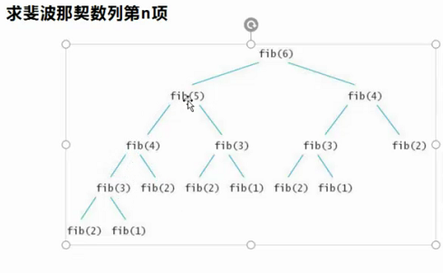
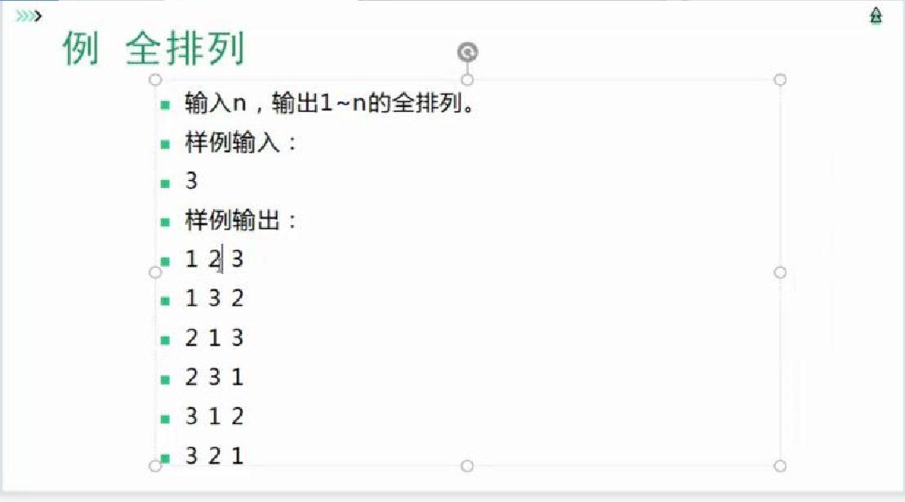

# 深度优先搜索
## 基本框架
```cpp
void dfs(状态){
    if(条件状态){
        代码块;
        return;
    }
    for(每一个新状态){
        if(状态合法){
            代码块;
        }
        dfs(新状态)
    }
}
```

**举个例子———斐波那切数列**


## 数字
```cpp
#include<iostream>

int ans,n;
int a[114][114];

void dfs(int i,int j,int sum){
    if(i==n){
        ans=std::max(ans,sum);
        return;
    }
    dfs(i+1,j+1,sum+a[i+1][j]);
    dfs(i+1,j+1,sum+a[i+1][j+1]);
}

int main(){
	std::cin>>n;
	for(int i=1;i<=n;i++){
		for(int j=1;j<=i;j++){
			std::cin>>a[i][j];
		}
	}
    dfs(1,1,a[1][1]);
    std::cout<<ans;
    return 0;
}
```

# 全排列
## 题目

就是将n~1这些数字的所有排列组合方式输出
## 参考代码
```cpp
#include<iostream>
using namespace std;

int a[10],n;
bool visited[10];

void dfs(int index){
	if(index==n+1){
		for(int i=1;i<=n;i++){
			cout<<a[i]<<" ";
		}
		cout<<endl;
		return;
	}
	for(int i=1;i<=n;i++){
		if(visited[i]){
			continue;
		}
		a[index]=i;
		visited[i]=1;
		dfs(index+1);
		visited[i]=0;
	}
}

int main(){
	cin>>n;
	dfs(1);
	return 0;
}
```
## 字符全排列
```cpp
#include<iostream>
using namespace std;

int n;
char a[100];
bool visited[100];

void dfs(int index){
	if(index==n+1){
		for(int i=1;i<=n;i++){
			cout<<a[i]<<" ";
		}
		cout<<endl;
		return;
	}
	for(int i=1;i<=n;i++){
		if(visited[i]){
			continue;
		}
		a[index]=char(i+'a'-1);
		visited[i]=1;
		dfs(index+1);
		visited[i]=0;
	}
}

int main(){
	cin>>n;
	dfs(1);
	return 0;
}
```