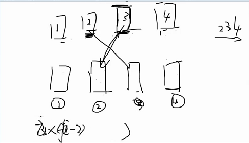

# 栈

函数调用需要存入栈，每调用一次分配一个栈帧。
特点：先进后出！
# 内存

第一部分：进程本身的内存
第二部分：堆区
第三部分：栈区
# 栈溢出

栈满了，装不下了。
递归太深会导致栈满了。

# 斯特林数（递推）

## 递推式

```S(n,m)=S(n-1,m-1)+m*S(n-1,m)	//(n>=m>=1)```

## 边界条件

`S(n,0)=0;S(n,1)=1;S(n,n)=1;S(n,k)=0	//(k>n)`

## 集合划分示例代码（核心）

```cpp
#include<bits/stdc++.h>

using namespace std;

long long f[35][35];

int main(){
    int n,k;
    cin>>n>>k;
    for(int i=1;i<=n;i++){
        f[i][i]=1;
    	f[i][1]=1;
	}
    for(int i=3;i<=n;i++){
        for(int j=2;j<i;j++){
            f[i][j]=f[i-1][j-1]+j*f[i-1][j];
        }
    }

    cout<<f[n][k];
    return 0;
}

```
# 递推――信封错排
```
D(n)=(n-1)(D(n-2)+D(n-1))
```
**边界条件**
D(1)=0;D(2)=1;


